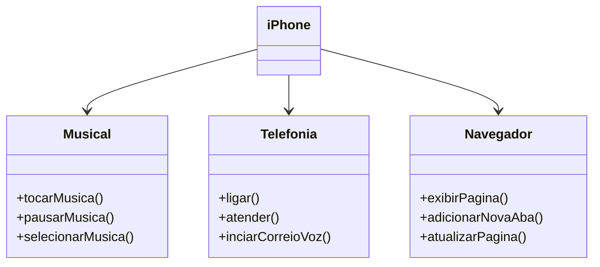

# interfaces-iphone
Desafio da formação Developer Java da Dio, cujo objetivo é criar as classes que compoe o iphone, interpretando o vídeo de lançamento do iphone de 2007.

### Diagrama UML (Iphone 2007)

