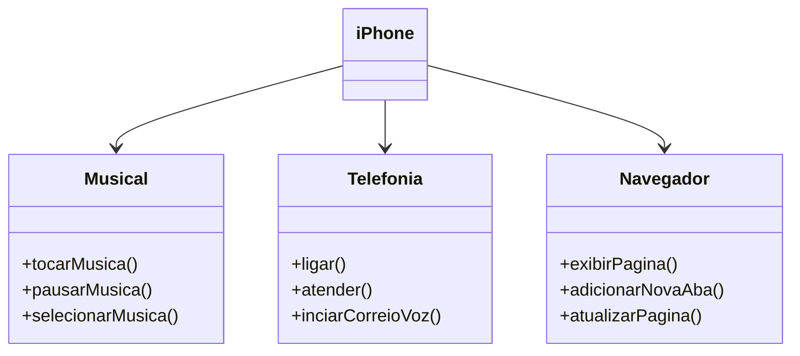

# interfaces-iphone
Desafio da formação Developer Java da Dio, cujo objetivo é criar as classes e interfaces que compõe o iphone, interpretando o vídeo de lançamento do iphone de 2007.

## Objetivo
Criar um diagrama UML que represente as funcionalidades do lançamento do iphone de 2007.
Identiciar os requisitos e implementar as classes e interfaces correspondentes em Java.

### Diagrama UML (Iphone 2007)

